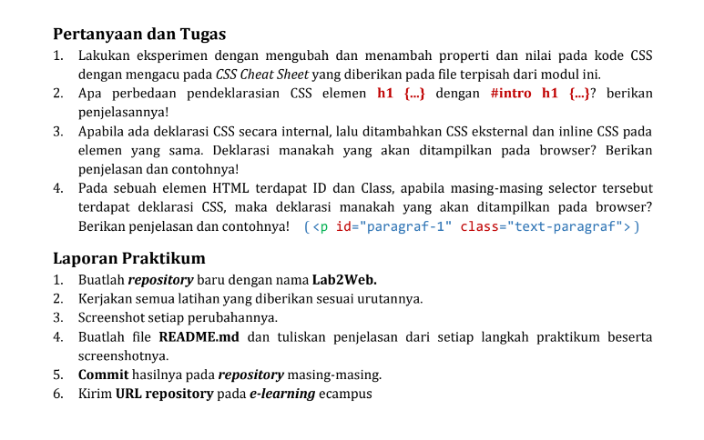
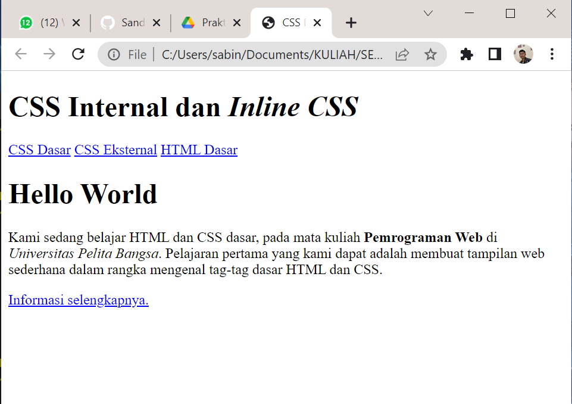
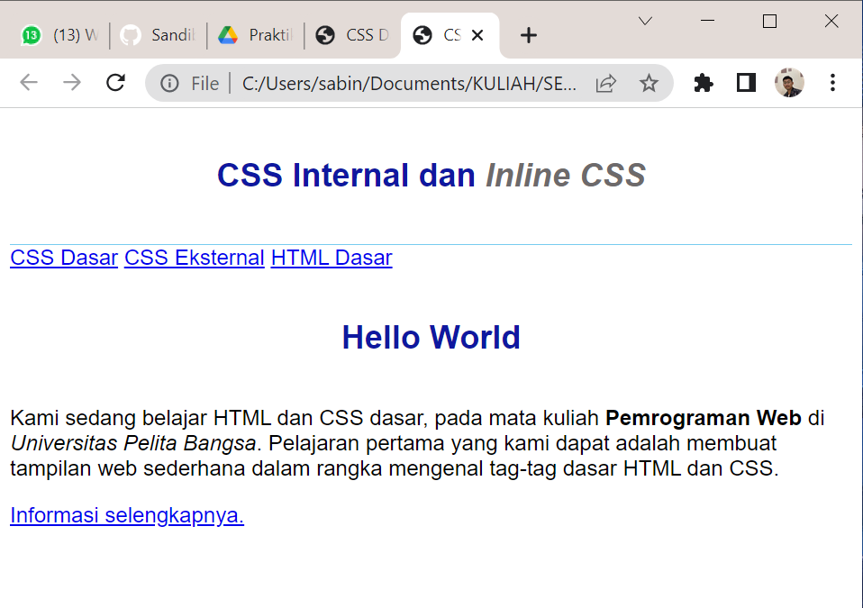

# Lab2Web
Repository ini di buat untuk memenuhi tugas pertemuan 3
<hr>
Nama	: SANDI BINTARA
<hr>
NIM	: 312010039
<hr>
<br>

# Tugas
<br>



<br>

# Jawaban !
<hr>
# Pernyataan Tugas
<br>

>1. Lakukan eksperimen dengan mengubah dan menambah properti dan nilai pada kode CSS
dengan mengacu pada CSS Cheat Sheet yang diberikan pada file terpisah dari modul ini.
<br>

>2. Apa perbedaan pendeklarasian CSS elemen h1 {...} dengan #intro h1 {...}? berikan
penjelasannya!
<br>

>3. Apabila ada deklarasi CSS secara internal, lalu ditambahkan CSS eksternal dan inline CSS pada
elemen yang sama. Deklarasi manakah yang akan ditampilkan pada browser? Berikan
penjelasan dan contohnya!
<br>

>4. Pada sebuah elemen HTML terdapat ID dan Class, apabila masing-masing selector tersebut
terdapat deklarasi CSS, maka deklarasi manakah yang akan ditampilkan pada browser?
Berikan penjelasan dan contohnya! ( <p id="paragraf-1" class="text-paragraf"> )
<br>

# Praktikum

<h1>Membuat Dokumen HTML</h1>
<br>

> Syntax HTML CSS
<br>

```
<!DOCTYPE html>
<html lang="en">
<head>
<meta charset="UTF-8">
<meta name="viewport" content="width=device-width, initial-scale=1.0">
<title>CSS Dasar</title>
</head>
<body>
<header>
<h1>CSS Internal dan <i>Inline CSS</i></h1>
</header>
<nav>
<a href="lab2_css_dasar.html">CSS Dasar</a>
<a href="lab2_css_eksternal.html">CSS Eksternal</a>
<a href="lab1_tag_dasar.html">HTML Dasar</a>
</nav>
<!-- CSS ID Selector -->
<div id="intro">
<h1>Hello World</h1>
<p>Kami sedang belajar HTML dan CSS dasar, pada mata kuliah <b>Pemrograman
Web</b> di <i>Universitas Pelita Bangsa</i>. Pelajaran pertama yang kami dapat
adalah membuat tampilan web sederhana dalam rangka mengenal tag-tag dasar HTML
dan CSS.</p>
<!-- CSS Class Selector -->
<a class="button btn-primary" href="#intro">Informasi selengkapnya.</a>
</div>
</body>
</html>
```
<br>

> Output
<br>


<br>

<h1>Css Dasar</h1>
<br>

> Syntax
<br>

```
<head>
<title>CSS Dasar</title>
<style>
body {
font-family:'Open Sans', sans-serif;
}
header {
min-height: 80px;
border-bottom:1px solid #77CCEF;
}
h1 {
font-size: 24px;
color: #0F189F;
text-align: center;
padding: 20px 10px;
}
h1 i {
color:#6d6a6b;
}
</style>
```
<br>

> font-family (menentukan jenis font yang akan di Pilih)| header = min-heaight & border bottom (merupakan posisi header dengan minimal ketinggian XX pixel dan garis bawah menggunakan kerapatan XX pixel)| font size (ukuran huruf)|color (warna dengan kode warna solid bisa di akses sesuai keinginan di [https://cssgradient.io/])
<br>

<h2> Output </h2>
<hr>




